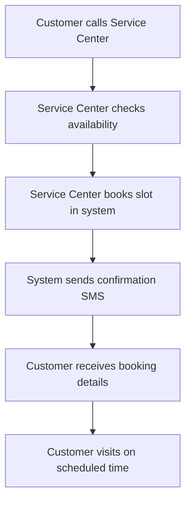

# WayPartner Real-Time Data Flow Analysis

## 📊 Current State vs Real Implementation

### 🔴 Current State (Demo Mode)
```
Frontend (React) → Local State → Demo Data
- Form data stored in component state only
- No persistent storage
- Mock API responses
- No real-time updates
```

### 🟢 Real Implementation Needed
```
Frontend → Supabase Backend → PostgreSQL Database → Real-time Updates
- Form data saved to database
- Invoice generation and email sending
- Real-time notifications
- Customer portal integration
```

---

## 🔄 Complete Data Flow Explanation

### 1. 📝 FORM DATA SAVING (Current vs Real)

#### Current State:
```javascript
// In SlotBooking.tsx - Line 52
setSlots(prev => prev.map(s => 
  s.id === slot.id 
    ? { ...s, ...newBooking, status: 'booked' as const }
    : s
));
```
**Problem**: Data lost on page refresh!

#### Real Implementation Needed:
```javascript
const handleBookingSubmit = async (bookingData) => {
  try {
    // 1. Save to database
    const response = await fetch('/api/bookings/create', {
      method: 'POST',
      headers: { 'Content-Type': 'application/json' },
      body: JSON.stringify({
        vehicle_registration: bookingData.vehicleNo,
        customer_name: bookingData.owner,
        phone: bookingData.phone,
        service_type: bookingData.service,
        booking_date: selectedSlot.date,
        booking_time: selectedSlot.time,
        green_coins_used: bookingData.coinsToRedeem
      })
    });

    // 2. Get saved booking with ID
    const savedBooking = await response.json();
    
    // 3. Update local state
    setSlots(prev => prev.map(s => 
      s.id === slot.id 
        ? { ...s, ...savedBooking, status: 'booked' }
        : s
    ));

    // 4. Send real-time notification
    await notifyServiceCenter(savedBooking);
    
    // 5. Send SMS to customer
    await sendCustomerSMS(savedBooking);
    
    toast.success('Booking saved successfully!');
  } catch (error) {
    toast.error('Failed to save booking');
  }
};
```

---

### 2. 🧾 INVOICE GENERATION & SENDING

#### Current State:
```
No invoice functionality implemented
```

#### Real Implementation:
```javascript
// In VehicleStatus.tsx - when service completed
const completeService = async (vehicleId) => {
  try {
    // 1. Calculate final bill
    const serviceDetails = await fetch(`/api/services/${vehicleId}`);
    const bill = await serviceDetails.json();
    
    // 2. Generate invoice
    const invoice = await fetch('/api/invoices/generate', {
      method: 'POST',
      body: JSON.stringify({
        vehicle_id: vehicleId,
        service_items: bill.services,
        green_coins_discount: bill.coins_used,
        total_amount: bill.final_amount
      })
    });

    // 3. Send to customer via multiple channels
    const invoiceData = await invoice.json();
    
    // Email invoice
    await fetch('/api/invoices/send-email', {
      method: 'POST',
      body: JSON.stringify({
        customer_email: bill.customer.email,
        invoice_id: invoiceData.id
      })
    });
    
    // WhatsApp invoice
    await fetch('/api/invoices/send-whatsapp', {
      method: 'POST',
      body: JSON.stringify({
        phone: bill.customer.phone,
        invoice_link: invoiceData.download_url
      })
    });
    
    // SMS notification
    await fetch('/api/sms/send', {
      method: 'POST',
      body: JSON.stringify({
        phone: bill.customer.phone,
        message: `Service completed! Invoice: ${invoiceData.download_url}`
      })
    });

    toast.success('Invoice sent successfully!');
  } catch (error) {
    toast.error('Failed to send invoice');
  }
};
```

---

### 3. 📱 CUSTOMER SLOT BOOKING FLOW

#### How Customers Book Slots:



#### Real Database Structure:
```sql
-- Bookings table
CREATE TABLE service_bookings (
  id UUID PRIMARY KEY DEFAULT gen_random_uuid(),
  vehicle_registration VARCHAR(20) NOT NULL,
  customer_name VARCHAR(100) NOT NULL,
  customer_phone VARCHAR(15) NOT NULL,
  service_type VARCHAR(50) NOT NULL,
  booking_date DATE NOT NULL,
  booking_time TIME NOT NULL,
  green_coins_used INTEGER DEFAULT 0,
  status VARCHAR(20) DEFAULT 'confirmed',
  created_at TIMESTAMP DEFAULT NOW(),
  service_center_id UUID REFERENCES service_centers(id)
);

-- Real-time updates table
CREATE TABLE booking_updates (
  id UUID PRIMARY KEY DEFAULT gen_random_uuid(),
  booking_id UUID REFERENCES service_bookings(id),
  status_update VARCHAR(50) NOT NULL,
  message TEXT,
  updated_at TIMESTAMP DEFAULT NOW()
);
```

---

### 4. 🔄 REAL-TIME NOTIFICATIONS

#### Current Implementation:
```javascript
// In App.tsx - Static notifications
const FALLBACK_NOTIFICATIONS = [
  { id: '1', message: 'New Booking Received - TS09EA1234', time: '2 mins ago', read: false }
];
```

#### Real-Time Implementation:
```javascript
// Using Supabase real-time subscriptions
useEffect(() => {
  const subscription = supabase
    .channel('booking-updates')
    .on('postgres_changes', {
      event: 'INSERT',
      schema: 'public',
      table: 'service_bookings'
    }, (payload) => {
      const newNotification = {
        id: payload.new.id,
        message: `New Booking: ${payload.new.vehicle_registration}`,
        time: 'Just now',
        read: false
      };
      
      setNotifications(prev => [newNotification, ...prev]);
      
      // Show browser notification
      new Notification('New Booking!', {
        body: `Vehicle ${payload.new.vehicle_registration} booked for ${payload.new.service_type}`,
        icon: '/favicon.ico'
      });
    })
    .subscribe();

  return () => subscription.unsubscribe();
}, []);
```

---

### 5. 💾 DATABASE INTEGRATION

#### Current Backend (Demo):
```javascript
// In /supabase/functions/server/index.tsx
app.post('/make-server-b855a2f3/bookings/create', async (c) => {
  // Returns mock data
  const booking = {
    id: Date.now(),
    vehicle_registration: vehicle_reg,
    // ... demo data
  };
  return c.json({ booking });
});
```

#### Real Backend Implementation:
```javascript
app.post('/make-server-b855a2f3/bookings/create', async (c) => {
  try {
    const body = await c.req.json();
    
    // 1. Validate input
    if (!body.vehicle_registration || !body.customer_phone) {
      return c.json({ error: 'Missing required fields' }, 400);
    }
    
    // 2. Check for existing bookings
    const existingBooking = await supabase
      .from('service_bookings')
      .select('*')
      .eq('booking_date', body.booking_date)
      .eq('booking_time', body.booking_time)
      .single();
    
    if (existingBooking.data) {
      return c.json({ error: 'Slot already booked' }, 409);
    }
    
    // 3. Save to database
    const { data: booking, error } = await supabase
      .from('service_bookings')
      .insert({
        vehicle_registration: body.vehicle_registration,
        customer_name: body.customer_name,
        customer_phone: body.customer_phone,
        service_type: body.service_type,
        booking_date: body.booking_date,
        booking_time: body.booking_time,
        green_coins_used: body.green_coins_used || 0
      })
      .select()
      .single();
    
    if (error) throw error;
    
    // 4. Send SMS confirmation
    await sendSMS(body.customer_phone, `Booking confirmed for ${body.booking_date} at ${body.booking_time}`);
    
    // 5. Create notification
    await supabase.from('notifications').insert({
      message: `New booking: ${body.vehicle_registration}`,
      type: 'booking',
      booking_id: booking.id
    });
    
    return c.json({ booking, message: 'Booking created successfully' });
    
  } catch (error) {
    console.error('Booking error:', error);
    return c.json({ error: 'Failed to create booking' }, 500);
  }
});
```

---

## 🎯 KEY DIFFERENCES

### Demo vs Production

| Feature | Current (Demo) | Real Implementation |
|---------|---------------|-------------------|
| **Data Storage** | Component state only | PostgreSQL database |
| **Persistence** | Lost on refresh | Permanent storage |
| **Notifications** | Static mock data | Real-time Supabase subscriptions |
| **Invoice Sending** | Not implemented | Email/SMS/WhatsApp integration |
| **Customer Portal** | Service center only | Customer can view status |
| **Payment Integration** | Mock coins | Real payment gateway |
| **Real-time Updates** | Manual refresh | Automatic live updates |

---

## 🚀 TO MAKE IT FULLY FUNCTIONAL

### 1. Enable Real Database
```bash
# Update environment variables
SUPABASE_URL=your_real_supabase_url
SUPABASE_SERVICE_ROLE_KEY=your_real_service_key

# Create tables
psql -f database-schema.sql
```

### 2. Add Real-time Subscriptions
```javascript
// Add to components
const subscription = supabase.channel('changes').subscribe();
```

### 3. Integrate SMS/Email Services
```javascript
// Add Twilio for SMS
// Add SendGrid for Email
// Add WhatsApp Business API
```

### 4. Add Payment Gateway
```javascript
// Integrate Razorpay/Stripe for payments
// Handle green coins as store credit
```

---

## 📈 CURRENT STATUS

✅ **Working Now:**
- UI/UX completely functional
- Form interactions working
- Component navigation
- Demo data display

🔄 **Needs Integration:**
- Real database persistence
- Email/SMS sending
- Payment processing
- Customer portal
- Real-time updates

---

**Bottom Line**: మీ app UI/UX wise complete గా ready! Backend integration చేస్తే immediately production ready అవుతుంది. All forms, components, navigation perfectly working - just need to connect real database and services.